# cert-manager External PKI Issuer

[](https://opensource.org/licenses/Apache-2.0)
[](https://golang.org)
[](https://cert-manager.io)

A Kubernetes controller that extends [cert-manager](https://cert-manager.io) to issue certificates from external PKI systems. This controller enables enterprises to integrate their existing Certificate Authority (CA) infrastructure with Kubernetes workloads.

## 🎯 Features

- **External PKI Integration**: Connect to any HTTP-based PKI/CA API
- **Configurable via ConfigMap**: No code changes needed to switch PKI endpoints
- **Multiple Authentication Methods**: Header-based, Basic Auth, Bearer tokens
- **ClusterIssuer & Issuer Support**: Cluster-wide or namespace-scoped issuers
- **Built-in Mock CA**: For testing and development
- **Standalone MockCA Server**: Deployable as a pod or standalone console app with extensive logging
- **Prometheus Metrics**: Built-in observability
- **Health Checks**: Kubernetes-native liveness/readiness probes

## 📋 Table of Contents

- [How It Works](#how-it-works)
- [Architecture](#architecture)
- [Prerequisites](#prerequisites)
- [Quick Start](#quick-start)
- [Installation](#installation)
- [Configuration](#configuration)
- [Usage](#usage)
- [MockCA Server](#mockca-server)
- [How It Works Inside AKS](#how-it-works-inside-aks)
- [Troubleshooting](#troubleshooting)
- [Contributing](#contributing)

## How It Works

This external issuer integrates with cert-manager's certificate lifecycle to enable certificate issuance from external PKI systems:

```mermaid
flowchart LR
    subgraph cluster["Kubernetes Cluster"]
        direction TB
        
        cert["📜 Certificate<br/>(User creates)"]
        cr["📋 CertificateRequest<br/>(cert-manager creates)"]
        controller["🔧 External Issuer<br/>Controller"]
        config["⚙️ ConfigMap<br/>(PKI API config)"]
        secret["🔐 Secret<br/>(tls.crt, tls.key)"]
    end
    
    pki["🏛️ External PKI API<br/>(Your CA System)"]
    
    cert -->|"1. triggers"| cr
    cr -->|"2. watches"| controller
    controller -->|"3. reads config"| config
    controller -->|"4. sends CSR"| pki
    pki -->|"5. returns signed cert"| controller
    controller -->|"6. updates status"| cr
    cr -->|"7. cert-manager creates"| secret
```



### Detailed Flow Inside AKS

1. **Certificate Request**: A user or system creates a `Certificate` resource referencing a `ClusterIssuer` or `Issuer` of type `external-issuer.io`

2. **cert-manager Processing**: cert-manager's controller:
   - Generates a private key
   - Creates a Certificate Signing Request (CSR)
   - Creates a `CertificateRequest` resource containing the CSR

3. **External Issuer Controller**:
   - Watches for `CertificateRequest` resources
   - Filters for requests targeting our issuer type (`external-issuer.io`)
   - Verifies the `CertificateRequest` is approved

4. **PKI Configuration Loading**:
   - Reads PKI API configuration from a `ConfigMap`
   - Loads authentication credentials from a `Secret`
   - Builds the appropriate HTTP request

5. **Certificate Signing**:
   - Extracts subject information from the CSR
   - Calls the external PKI API to sign the certificate
   - Parses the response to extract the certificate and CA chain

6. **Certificate Storage**:
   - Updates the `CertificateRequest` status with the signed certificate
   - cert-manager creates/updates the target `Secret` with `tls.crt`, `tls.key`, and `ca.crt`

7. **Automatic Renewal**:
   - cert-manager monitors certificate expiration
   - Automatically creates new `CertificateRequest` when renewal is needed
   - The external issuer signs the new CSR, completing the renewal

## Architecture

### Components

```mermaid
flowchart TB
    subgraph controller["External Issuer Controller"]
        subgraph manager["Controller Manager"]
            cr_rec["📋 CertificateReq<br/>Reconciler"]
            issuer_rec["🏷️ Issuer<br/>Reconciler"]
            cluster_rec["🌐 ClusterIssuer<br/>Reconciler"]
            
            cr_rec --> signer_pkg
            issuer_rec --> signer_pkg
            cluster_rec --> signer_pkg
        end
        
        subgraph signer_pkg["Signer Package"]
            pki["🔐 PKI Signer<br/>(Production)"]
            mock["🧪 Mock CA Signer<br/>(Development)"]
        end
    end
```



### Custom Resources

| Resource | Scope | Description |
| --- | --- | --- |
| `ExternalIssuer` | Namespaced | Issues certificates within a single namespace |
| `ExternalClusterIssuer` | Cluster | Issues certificates across all namespaces |

### Key Kubernetes Resources Used

| Resource | Namespace | Purpose |
| --- | --- | --- |
| `Deployment` | external-issuer-system | Runs the controller |
| `ServiceAccount` | external-issuer-system | Identity for RBAC |
| `ClusterRole` | - | Permissions to watch/update CRs |
| `ConfigMap` | external-issuer-system | PKI API configuration |
| `Secret` | external-issuer-system | Authentication credentials |

## Prerequisites

- Kubernetes cluster (1.25+)
- [cert-manager](https://cert-manager.io/docs/installation/) v1.12+
- `kubectl` access with cluster-admin privileges
- Container registry access (ACR, Docker Hub, etc.)
- Network connectivity from cluster to PKI API

## Quick Start

### 1. Install cert-manager

```bash
# Add Helm repo
helm repo add jetstack https://charts.jetstack.io
helm repo update

# Install cert-manager
helm install cert-manager jetstack/cert-manager \
  --namespace cert-manager \
  --create-namespace \
  --set crds.enabled=true
```

### 2. Deploy External Issuer

```bash
# Clone this repository
git clone https://github.com/bvorland/cert-manager-external-issuer.git
cd cert-manager-external-issuer

# Deploy with Mock CA (for testing)
kubectl apply -f deploy/

# Verify deployment
kubectl get pods -n external-issuer-system
```

### 3. Create Your First Certificate

```yaml
apiVersion: cert-manager.io/v1
kind: Certificate
metadata:
  name: my-app-tls
  namespace: default
spec:
  secretName: my-app-tls
  duration: 2160h  # 90 days
  renewBefore: 360h  # 15 days
  dnsNames:
    - my-app.example.com
  issuerRef:
    name: external-cluster-issuer
    kind: ExternalClusterIssuer
    group: external-issuer.io
```

```bash
kubectl apply -f my-certificate.yaml
kubectl get certificate my-app-tls -w
```

## Installation

See [INSTALLATION.md](docs/INSTALLATION.md) for detailed installation instructions.

### Alternative: Azure Cloud Shell

Deploy directly from your browser using Azure Cloud Shell - no local tools required!
See [AZURE-CLOUD-SHELL.md](docs/AZURE-CLOUD-SHELL.md) for the complete guide.

## Configuration

See [CONFIGURATION.md](docs/CONFIGURATION.md) for PKI API configuration details.

## Usage

See [USAGE.md](docs/USAGE.md) for usage examples and patterns.

## MockCA Server

A standalone Mock CA server is included for testing PKI API integration. It can be:

- **Run as a standalone console app** with extensive debug logging
- **Deployed as a Kubernetes pod** for testing in cluster
- **Used to test PKI signer configuration** before connecting to real PKI

```bash
# Run locally with debug logging
make run-mockca

# Or deploy to Kubernetes
kubectl apply -f deploy/mockca-server.yaml
```

See [MOCKCA-SERVER.md](docs/MOCKCA-SERVER.md) for full documentation.

## How It Works Inside AKS

See [HOW-IT-WORKS.md](docs/HOW-IT-WORKS.md) for a detailed technical deep-dive.

## CertificateRequest Approval

This controller follows cert-manager best practices for CertificateRequest approval. By default, cert-manager's internal approver handles approval via the included RBAC.

See [APPROVAL-PROCESS.md](docs/APPROVAL-PROCESS.md) for details on:
- How approval works
- RBAC configuration
- Integration with approver-policy

## E2E Testing

For end-to-end testing with Docker Hub and AKS:

```bash
# PowerShell
.\scripts\e2e-deploy-dockerhub.ps1
```

See [E2E-TESTING-PLAN.md](docs/E2E-TESTING-PLAN.md) for the complete testing plan.

## Troubleshooting

See [TROUBLESHOOTING.md](docs/TROUBLESHOOTING.md) for common issues and solutions.

## Security

See [SECURITY.md](SECURITY.md) for security policy and best practices.

## Contributing

Contributions are welcome! Please read [CONTRIBUTING.md](CONTRIBUTING.md) for details.

## License

This project is licensed under the Apache License 2.0 - see [LICENSE](LICENSE) file.
