# Architecture Deep Dive

This document provides detailed architecture diagrams and explanations of how the External Issuer works within Kubernetes and AKS.

## System Overview

```mermaid
flowchart TB
    subgraph cluster["Kubernetes Cluster"]
        subgraph apps["Application Namespaces"]
            app1["📦 App 1<br/>Certificate → Secret"]
            app2["📦 App 2<br/>Certificate → Secret"]
            app3["📦 App 3<br/>Certificate → Secret"]
        end
        
        subgraph cm_ns["cert-manager Namespace"]
            cm["🔧 cert-manager Controller<br/>• Certificate Watcher<br/>• CertificateRequest Generator<br/>• Watches for Signed Certs"]
        end
        
        subgraph ei_ns["external-issuer-system Namespace"]
            ei["🔧 External Issuer Controller<br/>• CertificateRequest Reconciler<br/>• PKI Signer (or MockCA)"]
            issuer["🏷️ ExternalClusterIssuer"]
            config["📄 ConfigMap<br/>(PKI API configuration)"]
        end
    end
    
    pki["🏛️ External PKI API<br/>• HashiCorp Vault<br/>• EJBCA<br/>• Venafi<br/>• Custom PKI"]
    
    app1 --> cm
    app2 --> cm
    app3 --> cm
    cm -->|"Creates CertificateRequest"| ei
    ei --> issuer
    issuer --> config
    ei <-->|"HTTPS"| pki
```

## Component Interactions

### Certificate Request Flow

## Kubernetes API Resources

### Custom Resource Definitions (CRDs)

### Relationship Between Resources

```mermaid
flowchart TB
    cert["📜 Certificate<br/>(cert-manager)"]
    cr["📋 CertificateRequest<br/>(cert-manager)"]
    issuer["🏷️ ExternalClusterIssuer<br/>(external-issuer.io)"]
    configmap["📄 ConfigMap<br/>(PKI config)"]
    authsecret["🔐 Secret<br/>(credentials)"]
    tlssecret["🔐 Secret<br/>(TLS certificate)<br/><br/>data:<br/>  tls.crt: ...<br/>  tls.key: ...<br/>  ca.crt: ..."]
    
    cert -->|"creates"| cr
    cr -->|"references"| issuer
    issuer --> configmap
    issuer --> authsecret
    cr -->|"produces"| tlssecret
```

## Controller Architecture

### Internal Components

```mermaid
flowchart TB
    subgraph controller["External Issuer Controller"]
        subgraph manager["Manager (controller-runtime)"]
            scheme["📋 Scheme with<br/>API Types"]
            health["❤️ Health Probes<br/>/healthz<br/>/readyz"]
            leader["🏆 Leader Election<br/>Coordination"]
            
            subgraph reconcilers["Reconcilers"]
                cr_rec["📋 CertificateRequest<br/>Reconciler<br/>• Watches CRs<br/>• Signs CSRs<br/>• Updates status"]
                issuer_rec["🏷️ IssuerReconciler<br/>• Validates config<br/>• Updates status"]
            end
        end
        
        subgraph signer["Signer Package"]
            pki_signer["🔐 PKISigner<br/>• HTTP client<br/>• Template render<br/>• Response parse"]
            mock_signer["🧪 MockCASigner<br/>• Self-signed CA<br/>• In-memory keys<br/>• Test mode"]
        end
        
        cr_rec --> signer
    end
```

## AKS-Specific Integration

### Network Architecture

```mermaid
flowchart TB
    subgraph vnet["Azure Virtual Network"]
        subgraph aks_subnet["AKS Subnet"]
            subgraph aks["AKS Cluster"]
                node1["🖥️ Node 1<br/>External Issuer Pod"]
                node2["🖥️ Node 2<br/>cert-manager Pod"]
                node3["🖥️ Node 3<br/>Istio Ingress GW<br/>(Reads TLS Secrets)"]
            end
        end
        
        subgraph pki_subnet["PKI Subnet"]
            pki_server["🏛️ PKI API Server<br/>• HashiCorp Vault<br/>• EJBCA<br/>• Custom PKI"]
        end
        
        node1 -->|"Private Endpoint<br/>or VNet Integration"| pki_server
    end
```

### Istio TLS Integration

```mermaid
flowchart TB
    client["👤 External Client"]
    
    subgraph cluster["AKS Cluster"]
        lb["⚖️ Azure Load Balancer<br/>(Internal or Public)"]
        
        subgraph istio["Istio Ingress Gateway Pod"]
            envoy["🔷 Envoy Proxy<br/>TLS Termination"]
        end
        
        secret["🔐 Secret (istio-system)<br/><b>gateway-tls-secret</b><br/>Referenced in Gateway spec<br/>• tls.crt: signed certificate<br/>• tls.key: private key<br/>• ca.crt: CA chain"]
        
        app["📦 Application Service<br/>VirtualService routes traffic"]
    end
    
    client -->|"HTTPS (443)"| lb
    lb --> envoy
    secret -.->|"SDS reads certs"| envoy
    envoy -->|"HTTP (internal)"| app
```

## Certificate Renewal Lifecycle

```mermaid
flowchart LR
    subgraph timeline["Certificate Lifecycle"]
        created["📜 Certificate<br/>Created"]
        valid["✅ Valid Period"]
        renew["🔄 Renewal Window<br/>(renewBefore)"]
        expire["⚠️ Expiration"]
    end
    
    created --> valid
    valid --> renew
    renew --> expire
    
    subgraph renewal_process["Renewal Process (in renewBefore window)"]
        step1["1️⃣ New CSR generated"]
        step2["2️⃣ CertificateRequest created"]
        step3["3️⃣ External Issuer signs"]
        step4["4️⃣ Secret updated"]
        step5["5️⃣ Istio reloads cert"]
        
        step1 --> step2 --> step3 --> step4 --> step5
    end
    
    renew -.->|"triggers"| renewal_process
    renewal_process -.->|"zero downtime"| valid
```

## Security Model

```mermaid
flowchart TB
    subgraph security["Security Boundaries"]
        subgraph rbac["🔒 RBAC Permissions (Least Privilege)"]
            can["✅ External Issuer CAN:<br/>• Read CertificateRequests (all namespaces)<br/>• Update CertificateRequest status<br/>• Read ConfigMaps (for PKI config)<br/>• Read Secrets (for PKI credentials)<br/>• Create Events (for observability)"]
            cannot["❌ External Issuer CANNOT:<br/>• Create/Delete Secrets<br/>• Modify Certificates<br/>• Access application Secrets<br/>• Modify cluster resources"]
        end
        
        subgraph pod["🛡️ Pod Security (Hardened)"]
            pod_sec["• runAsNonRoot: true<br/>• readOnlyRootFilesystem: true<br/>• allowPrivilegeEscalation: false<br/>• capabilities: drop ALL<br/>• seccompProfile: RuntimeDefault"]
        end
        
        subgraph network["🌐 Network Security"]
            net_sec["• All PKI API calls over HTTPS<br/>• TLS certificate verification<br/>• Private endpoints when possible<br/>• Network policies can restrict egress"]
        end
        
        subgraph secrets["🔐 Secrets Management"]
            sec_mgmt["• PKI credentials in K8s Secrets<br/>• Consider external-secrets<br/>• Private keys never leave cluster<br/>• Only CSRs (public) sent to PKI"]
        end
    end
```

