# How It Works: Deep Dive into AKS Integration

This document provides a detailed technical explanation of how the External PKI Issuer works inside an AKS (Azure Kubernetes Service) cluster.

## Table of Contents

1. [Component Overview](#component-overview)
2. [The Certificate Lifecycle](#the-certificate-lifecycle)
3. [Controller Internals](#controller-internals)
4. [Kubernetes API Interactions](#kubernetes-api-interactions)
5. [PKI Signing Flow](#pki-signing-flow)
6. [Integration with Istio](#integration-with-istio)

---

## Component Overview

### What Gets Deployed

When you install the External PKI Issuer, the following components are created:


### How Components Interact


---

## The Certificate Lifecycle

### Stage 1: Certificate Request

When a user creates a `Certificate` resource:

```yaml
apiVersion: cert-manager.io/v1
kind: Certificate
metadata:
  name: my-app-tls
  namespace: production
spec:
  secretName: my-app-tls
  duration: 2160h      # 90 days
  renewBefore: 360h    # Renew 15 days before expiry
  dnsNames:
    - my-app.example.com
    - www.my-app.example.com
  issuerRef:
    name: pki-cluster-issuer
    kind: ExternalClusterIssuer
    group: external-issuer.io
```

**What happens in AKS:**

1. kubectl/API server validates the Certificate resource
2. cert-manager's certificate controller sees the new Certificate
3. cert-manager generates a 2048-bit RSA private key
4. cert-manager creates a CSR (Certificate Signing Request) containing:
   - Subject information
   - DNS SANs from `dnsNames`
   - Key usage extensions

### Stage 2: CertificateRequest Creation

cert-manager creates a `CertificateRequest` resource:

```yaml
apiVersion: cert-manager.io/v1
kind: CertificateRequest
metadata:
  name: my-app-tls-xxxxx
  namespace: production
  ownerReferences:
    - apiVersion: cert-manager.io/v1
      kind: Certificate
      name: my-app-tls
spec:
  issuerRef:
    name: pki-cluster-issuer
    kind: ExternalClusterIssuer
    group: external-issuer.io
  request: |
    -----BEGIN CERTIFICATE REQUEST-----
    MIICvDCCAaQCAQAwdzELMAkGA1UEBhMCVVMxDTALBgNVBAgMBFRlc3QxDTALBgNV
    ...base64 encoded CSR...
    -----END CERTIFICATE REQUEST-----
  usages:
    - digital signature
    - key encipherment
    - server auth
status:
  conditions:
    - type: Approved
      status: "True"
      reason: "cert-manager.io"
```

### Stage 3: External Issuer Processing

The External Issuer controller:

1. **Watches** for `CertificateRequest` resources via the Kubernetes API
2. **Filters** to only process requests where `issuerRef.group == "external-issuer.io"`
3. **Validates** the request is approved and not already processed
4. **Loads** configuration from ConfigMap and credentials from Secret
5. **Calls** the external PKI API
6. **Updates** the CertificateRequest status with the signed certificate

### Stage 4: Secret Creation

Once the CertificateRequest is fulfilled, cert-manager:

1. Reads the signed certificate from `CertificateRequest.status.certificate`
2. Creates/updates the target Secret:

```yaml
apiVersion: v1
kind: Secret
metadata:
  name: my-app-tls
  namespace: production
  annotations:
    cert-manager.io/certificate-name: my-app-tls
    cert-manager.io/issuer-kind: ExternalClusterIssuer
    cert-manager.io/issuer-name: pki-cluster-issuer
type: kubernetes.io/tls
data:
  tls.crt: <base64-encoded-certificate-chain>
  tls.key: <base64-encoded-private-key>
  ca.crt: <base64-encoded-ca-certificate>
```

### Stage 5: Automatic Renewal

cert-manager monitors the certificate expiration:


---

## Controller Internals

### Reconciliation Loop

The controller uses the Kubernetes controller-runtime library:

```go
func (r *CertificateRequestReconciler) Reconcile(ctx context.Context, req ctrl.Request) (ctrl.Result, error) {
    // 1. Fetch the CertificateRequest
    cr := &cmapi.CertificateRequest{}
    if err := r.Get(ctx, req.NamespacedName, cr); err != nil {
        return ctrl.Result{}, client.IgnoreNotFound(err)
    }

    // 2. Check if this request is for our issuer type
    if cr.Spec.IssuerRef.Group != "external-issuer.io" {
        return ctrl.Result{}, nil  // Not our responsibility
    }

    // 3. Skip if already processed
    if len(cr.Status.Certificate) > 0 || isInTerminalState(cr) {
        return ctrl.Result{}, nil
    }

    // 4. Check if approved
    if !isCertificateRequestApproved(cr) {
        return ctrl.Result{}, nil  // Wait for approval
    }

    // 5. Get issuer configuration
    issuerSpec, err := r.getIssuerSpec(ctx, cr)
    if err != nil {
        return ctrl.Result{}, r.setStatus(ctx, cr, "IssuerNotFound", err.Error())
    }

    // 6. Load PKI configuration from ConfigMap
    pkiConfig, err := r.loadPKIConfig(ctx, issuerSpec.ConfigMapRef)
    if err != nil {
        return ctrl.Result{}, r.setStatus(ctx, cr, "ConfigError", err.Error())
    }

    // 7. Create signer and sign the CSR
    signer := NewPKISigner(pkiConfig)
    certPEM, caPEM, err := signer.Sign(cr.Spec.Request, 365)
    if err != nil {
        return ctrl.Result{}, r.setStatus(ctx, cr, "SigningFailed", err.Error())
    }

    // 8. Update CertificateRequest with signed certificate
    cr.Status.Certificate = certPEM
    cr.Status.CA = caPEM
    return ctrl.Result{}, r.setStatus(ctx, cr, "Issued", "Certificate issued successfully")
}
```

### Controller Manager Configuration

```go
mgr, err := ctrl.NewManager(ctrl.GetConfigOrDie(), ctrl.Options{
    Scheme:                 scheme,
    MetricsBindAddress:     ":8080",
    HealthProbeBindAddress: ":8081",
    LeaderElection:         true,
    LeaderElectionID:       "external-issuer.io",
})
```

**Key behaviors:**

- **Leader Election**: Only one controller instance processes requests at a time
- **Health Probes**: `/healthz` and `/readyz` endpoints for Kubernetes
- **Metrics**: Prometheus metrics exposed on `:8080`
- **Watch Filtering**: Only processes relevant CertificateRequests

---

## Kubernetes API Interactions

### RBAC Requirements

The controller needs these permissions:

```yaml
apiVersion: rbac.authorization.k8s.io/v1
kind: ClusterRole
metadata:
  name: external-issuer-controller
rules:
  # Watch and update CertificateRequests
  - apiGroups: ["cert-manager.io"]
    resources: ["certificaterequests"]
    verbs: ["get", "list", "watch"]
  - apiGroups: ["cert-manager.io"]
    resources: ["certificaterequests/status"]
    verbs: ["get", "update", "patch"]
  
  # Read our issuer types
  - apiGroups: ["external-issuer.io"]
    resources: ["externalissuers", "externalclusterissuers"]
    verbs: ["get", "list", "watch"]
  - apiGroups: ["external-issuer.io"]
    resources: ["externalissuers/status", "externalclusterissuers/status"]
    verbs: ["get", "update", "patch"]
  
  # Read configuration
  - apiGroups: [""]
    resources: ["configmaps", "secrets"]
    verbs: ["get", "list", "watch"]
  
  # Create events for observability
  - apiGroups: [""]
    resources: ["events"]
    verbs: ["create", "patch"]
```

### Watch Mechanism

The controller establishes persistent watches on the Kubernetes API:


---

## PKI Signing Flow

### Step-by-Step Signing Process

```mermaid
flowchart TB
    subgraph controller["External Issuer Controller"]
        step1["1️⃣ Receive CertificateRequest<br/>with CSR (PEM encoded)"]
        step2["2️⃣ Parse CSR<br/>Subject: CN=my-app.example.com<br/>DNS SANs: my-app.example.com, www.my-app.example.com<br/>Key Usage: digitalSignature, keyEncipherment"]
        step3["3️⃣ Build HTTP Request<br/>POST https://pki.example.com/api/sign<br/>Authorization: Bearer token<br/>Content-Type: application/x-www-form-urlencoded"]
        
        step1 --> step2
        step2 --> step3
    end
    
    network["🌐 Network (HTTPS)<br/>May go through Azure FW"]
    
    subgraph pki["External PKI API"]
        step4["4️⃣ PKI validates & signs<br/>• Checks authorization<br/>• Validates subject against policy<br/>• Signs certificate with CA private key"]
        step5["5️⃣ Returns certificate chain<br/>• Leaf certificate<br/>• Intermediate CA<br/>• Root CA"]
        
        step4 --> step5
    end
    
    step3 --> network
    network --> step4
    step5 --> controller
```



---

## Integration with Istio

When used with Istio service mesh, the certificates enable TLS at the ingress gateway:

```mermaid
flowchart TB
    client["👤 External Client"]
    
    subgraph cluster["AKS Cluster"]
        lb["⚖️ Azure Load Balancer<br/>(Internal or External)"]
        
        subgraph istio["Istio Ingress Gateway"]
            gw["🌐 Gateway Resource<br/>spec.servers[0].tls.mode: SIMPLE<br/>credentialName: my-app-tls"]
            envoy["🔷 Envoy Proxy<br/>TLS Termination"]
        end
        
        secret["🔐 Secret: my-app-tls<br/>(istio-system namespace)<br/>• tls.crt: certificate from External Issuer<br/>• tls.key: private key from cert-manager<br/>• ca.crt: CA chain from External Issuer"]
        
        subgraph app["Application Pod"]
            sidecar["🔷 Istio Sidecar<br/>(Envoy - handles mTLS)"]
            container["📦 Application Container"]
        end
    end
    
    client -->|"HTTPS (443)"| lb
    lb --> envoy
    secret -.->|"SDS reads certs"| envoy
    gw --> envoy
    envoy -->|"HTTP (internal) / mTLS"| sidecar
    sidecar --> container
```



### Istio Certificate Flow

1. **Certificate Created**: User creates Certificate resource targeting `istio-system` namespace
2. **Secret Generated**: External Issuer signs, cert-manager creates Secret in `istio-system`
3. **SDS Discovery**: Istio's pilot watches for Secrets matching Gateway `credentialName`
4. **Hot Reload**: Envoy receives new certificate via xDS, no restart needed
5. **TLS Termination**: Ingress Gateway uses the certificate for HTTPS

### Zero-Downtime Renewal


---

## Summary

The External PKI Issuer extends cert-manager with these key capabilities:

1. **Declarative**: Certificates defined as Kubernetes resources
2. **Automated**: Full lifecycle management including renewal
3. **Configurable**: PKI settings in ConfigMap, easy to update
4. **Secure**: Credentials in Secrets, RBAC-controlled access
5. **Observable**: Prometheus metrics, Kubernetes events
6. **Cloud-Native**: Works with Istio, Ingress, and any TLS consumer
